# ms-securitytoken-facade

[](https://openjdk.org/)
[](https://spring.io/projects/spring-boot)
[](#architecture)
[](LICENSE)

`ms-securitytoken-facade` is a reactive security facade built with **Java 21**, **Spring Boot** and **Spring WebFlux**.

It acts as an intermediary between client applications and an identity provider compatible with **OAuth 2.0 / OpenID Connect**, such as Keycloak.

The service receives encrypted OAuth credentials, resolves the cryptographic configuration associated with the consumer channel, decrypts the credentials using **AES-256-CBC**, and forwards the resulting request to the configured SSO provider.

The project follows **Hexagonal Architecture (Ports & Adapters)** principles to keep application and domain logic isolated from HTTP, cryptography, configuration and external identity-provider infrastructure.

---

## Table of Contents

- [Overview](#overview)
- [How It Works](#how-it-works)
- [Request Flow](#request-flow)
- [API](#api)
- [Encryption](#encryption)
- [Encryption Mode Detection](#encryption-mode-detection)
- [Architecture](#architecture)
- [Project Structure](#project-structure)
- [Technology Stack](#technology-stack)
- [Configuration](#configuration)
- [Kubernetes](#kubernetes)
- [Security](#security)
- [Error Handling](#error-handling)
- [SSO Integration](#sso-integration)
- [Reactive Flow](#reactive-flow)
- [Running Locally](#running-locally)
- [Testing](#testing)
- [Build](#build)
- [Contributing](#contributing)
- [License](#license)

---

# Overview

Client applications do not send OAuth credentials directly to the identity provider in plain text.

Instead, the following parameters are encrypted before being sent to the facade:

- `client_id`
- `client_secret`
- `grant_type`
- `scope`

The request also contains a `channel` parameter in plain text.

The channel identifies the cryptographic configuration required to decrypt the request.

Once the credentials have been decrypted, the facade builds a standard OAuth request using:

```http
Content-Type: application/x-www-form-urlencoded
```

and forwards it to the configured identity provider.

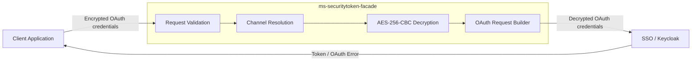

---

# How It Works

The service processes each token request using the following sequence:

1. Receives the OAuth-compatible HTTP request.
2. Validates required parameters.
3. Resolves the cryptographic configuration using `channel`.
4. Decrypts the OAuth credentials.
5. Builds the standard OAuth form request.
6. Sends the request to the configured SSO.
7. Receives the OAuth response.
8. Returns the corresponding HTTP response to the client.

The facade therefore allows consumers to use encrypted credentials without requiring modifications to the downstream identity provider.

---

# Request Flow

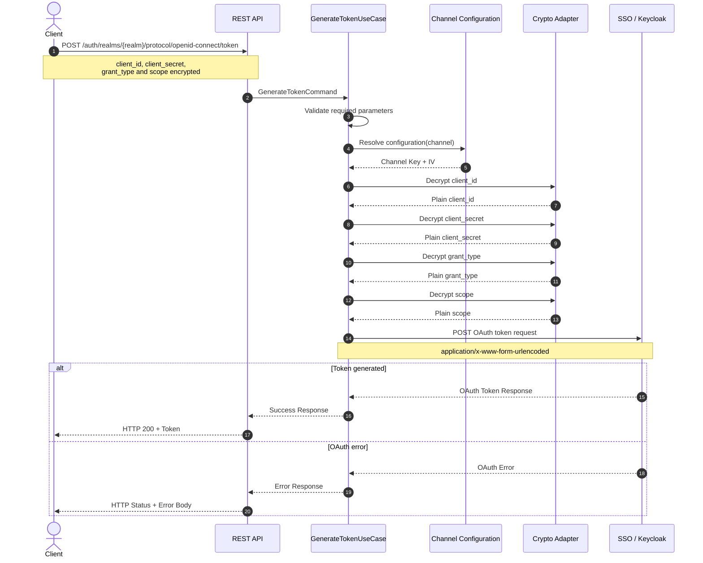

---

# API

## Generate Token

### Endpoint

```http
POST /auth/realms/{realm}/protocol/openid-connect/token
```

### Content Type

```http
Content-Type: application/x-www-form-urlencoded
```

---

## Path Parameters

| Parameter | Type | Required | Description |
|---|---|---:|---|
| `realm` | `String` | Yes | Identity provider realm receiving the OAuth request |

---

## Form Parameters

| Parameter | Encrypted | Required | Description |
|---|---:|---:|---|
| `client_id` | Yes | Yes | OAuth client identifier |
| `client_secret` | Yes | Yes | OAuth client secret |
| `grant_type` | Yes | Yes | OAuth grant type |
| `scope` | Yes | Yes | Requested OAuth scope |
| `channel` | No | Yes | Channel used to resolve cryptographic configuration |
| `salt` | Depends on contract | Depends on configuration | Salt information associated with the encryption mechanism |

---

## Example Request

```bash
curl --location \
  --request POST \
  'http://localhost:8081/auth/realms/api-ext-dev/protocol/openid-connect/token' \
  --header 'Accept: application/json' \
  --header 'Content-Type: application/x-www-form-urlencoded' \
  --data-urlencode 'client_id=<encrypted-client-id>' \
  --data-urlencode 'client_secret=<encrypted-client-secret>' \
  --data-urlencode 'grant_type=<encrypted-grant-type>' \
  --data-urlencode 'scope=<encrypted-scope>' \
  --data-urlencode 'salt=<salt>' \
  --data-urlencode 'channel=8'
```

> Never commit real credentials, cryptographic keys, IVs, access tokens or encrypted production payloads to the repository.

---

## Example Successful Response

The response corresponds to the payload returned by the configured identity provider.

```json
{
  "access_token": "<access-token>",
  "expires_in": 300,
  "refresh_expires_in": 0,
  "token_type": "Bearer",
  "not-before-policy": 0,
  "scope": "profile email"
}
```

---

# Encryption

The service supports symmetric encryption based on the following configuration:

| Property | Value |
|---|---|
| Algorithm | AES |
| Key size | 256 bits |
| Mode | CBC |
| Encoding | Base64 |
| Key derivation | PBKDF2 |
| PRF | HMAC-SHA1 |
| Iterations | 10,000 |

Two encryption mechanisms are supported to maintain interoperability with existing consumers.

---

## Encryption with Salt

The encrypted payload uses the following format:

```text
saltHex(32 characters) + base64(cipherText)
```

The AES key is derived using:

```text
PBKDF2WithHmacSHA1(
    channelKey,
    salt,
    10000,
    256 bits
)
```

The resulting key is used by AES-256-CBC together with the configured initialization vector.

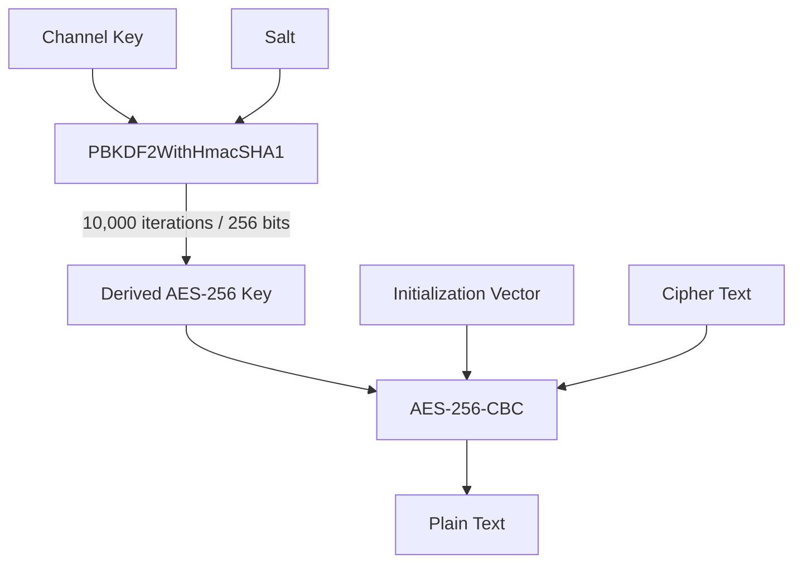

---

## Legacy Encryption without Salt

For backwards compatibility, the facade also supports payloads with the following format:

```text
base64(cipherText)
```

In this mode, the channel key is used directly as the AES-256 key.

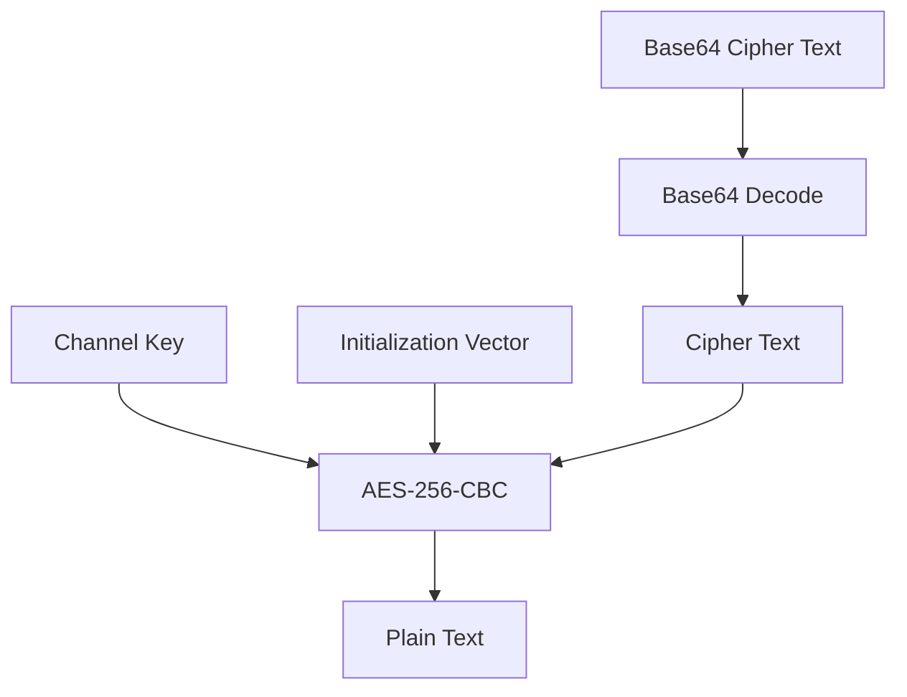

This mechanism exists exclusively to maintain interoperability with clients using the legacy encryption scheme.

---

# Encryption Mode Detection

The facade automatically determines which decryption strategy should be applied.

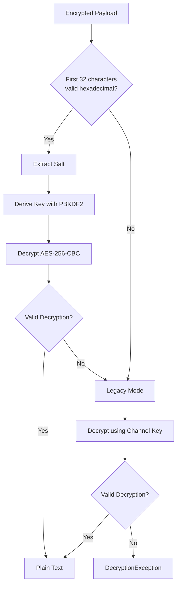

The strategy allows new encrypted payloads and legacy consumers to coexist without requiring separate endpoints.

---

# Architecture

The project follows **Hexagonal Architecture**, also known as **Ports & Adapters**.

The main objective is to isolate application logic from infrastructure concerns.

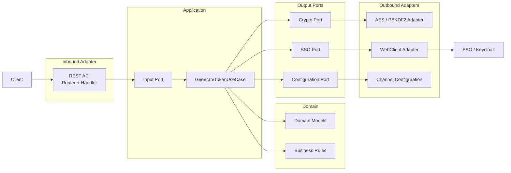

---

# Project Structure

```text
ms-securitytoken-facade/
│
├── domain/
│   ├── model/
│   ├── exception/
│   └── service/
│
├── application/
│   ├── port/
│   │   ├── in/
│   │   └── out/
│   └── usecase/
│
├── helpers/
│   └── crypto/
│
├── adapter-in-rest/
│   ├── router/
│   ├── handler/
│   ├── dto/
│   └── mapper/
│
├── adapter-out-client/
│   ├── config/
│   ├── client/
│   └── dto/
│
└── bootstrap/
    └── configuration/
```

## Domain

Contains domain models, exceptions and business rules.

The domain layer should remain independent of:

- HTTP;
- Spring WebFlux;
- WebClient;
- configuration mechanisms;
- external identity providers.

---

## Application

Contains application use cases and input/output ports.

The main use case coordinates the token generation workflow:

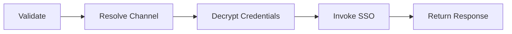

---

## Inbound REST Adapter

Exposes the HTTP API using Spring WebFlux.

Its responsibilities include:

- HTTP routing;
- request parsing;
- request DTO validation;
- mapping requests to application commands;
- invoking input ports;
- building HTTP responses.

---

## Outbound SSO Adapter

Implements the integration with the external identity provider using Spring `WebClient`.

The adapter is responsible for translating application requests into the OAuth request expected by the SSO.

---

## Crypto Adapter

Implements the cryptographic operations required by the application ports.

It encapsulates:

- AES-256-CBC;
- Base64;
- PBKDF2;
- salt processing;
- legacy encryption compatibility.

Cryptographic implementation details should not leak into the application use cases.

---

## Bootstrap

Acts as the application's **Composition Root**.

It contains the Spring configuration responsible for wiring ports, adapters and application use cases.

---

# Technology Stack

| Technology | Purpose |
|---|---|
| Java 21 | Runtime and programming language |
| Spring Boot | Application framework |
| Spring WebFlux | Reactive HTTP API |
| Project Reactor | Reactive programming |
| WebClient | Non-blocking HTTP client |
| Gradle | Build and dependency management |
| AES-256-CBC | Symmetric encryption |
| PBKDF2WithHmacSHA1 | Key derivation |
| Keycloak | OAuth 2.0 / OpenID Connect identity provider used for integration |

---

# Configuration

Application configuration is located under:

```text
src/main/resources/application.yml
```

Sensitive values should always be externalized using environment variables or a secret-management solution.

Example:

```yaml
security-token:

  sso:
    url: ${SSO_URL}
    timeout-ms: ${SSO_TIMEOUT_MS:5000}

  channels:

    8:
      key: ${CHANNEL_8_KEY}
      iv: ${CHANNEL_8_IV}

    9:
      key: ${CHANNEL_9_KEY}
      iv: ${CHANNEL_9_IV}
```

---

## Environment Variables

| Variable | Sensitive | Description |
|---|---:|---|
| `SSO_URL` | No | Base URL of the identity provider |
| `SSO_TIMEOUT_MS` | No | SSO request timeout |
| `CHANNEL_8_KEY` | **Yes** | Cryptographic key for channel 8 |
| `CHANNEL_8_IV` | **Yes** | Initialization vector for channel 8 |
| `CHANNEL_9_KEY` | **Yes** | Cryptographic key for channel 9 |
| `CHANNEL_9_IV` | **Yes** | Initialization vector for channel 9 |
| `LOG_LEVEL` | No | Application logging level |

Example for local development:

```bash
export SSO_URL=http://localhost:8080
export SSO_TIMEOUT_MS=5000

export CHANNEL_8_KEY=<development-key>
export CHANNEL_8_IV=<development-iv>
```

PowerShell:

```powershell
$env:SSO_URL="http://localhost:8080"
$env:SSO_TIMEOUT_MS="5000"

$env:CHANNEL_8_KEY="<development-key>"
$env:CHANNEL_8_IV="<development-iv>"
```

---

# Kubernetes

For Kubernetes deployments, configuration should be separated according to sensitivity.

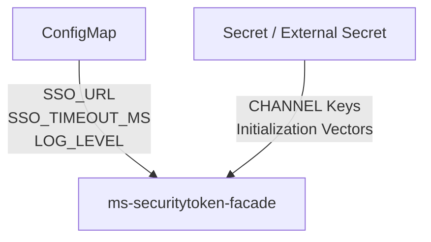

## ConfigMap

Non-sensitive operational configuration can be stored in a Kubernetes `ConfigMap`.

Examples:

```text
SSO_URL
SSO_TIMEOUT_MS
LOG_LEVEL
```

## Secret

Cryptographic material must be stored as secrets.

Examples:

```text
CHANNEL_8_KEY
CHANNEL_8_IV
CHANNEL_9_KEY
CHANNEL_9_IV
```

Cryptographic keys and OAuth secrets must **never** be hardcoded in:

```text
application.yml
Dockerfile
ConfigMap
README.md
source code
shell scripts
Git history
logs
```

Production environments should preferably use the secret-management mechanism provided by the deployment platform.

Examples include:

- Kubernetes Secrets;
- HashiCorp Vault;
- cloud-native secret managers;
- External Secrets Operator.

---

# Security

This service handles sensitive cryptographic material and OAuth credentials.

The following values must be treated as sensitive:

```text
client_id
client_secret
access_token
refresh_token
channel keys
initialization vectors
decrypted payloads
```

Sensitive values must not be written directly to application logs.

Avoid:

```java
log.info("client_secret={}", clientSecret);
log.debug("decrypted credentials={}", credentials);
```

Prefer structured logging with explicit masking or redaction.

For example:

```text
client_id=********
client_secret=********
access_token=********
```

## Security Guidelines

Contributors should follow these principles:

- never commit production secrets;
- never log decrypted credentials;
- never expose cryptographic keys through REST responses;
- externalize secrets from `application.yml`;
- use TLS for production communication;
- rotate channel keys according to the deployment security policy;
- use environment-specific credentials;
- use synthetic credentials in automated tests;
- review dependencies for known vulnerabilities;
- avoid including access or refresh tokens in error messages.

If a security vulnerability is discovered, avoid publishing credentials, exploit payloads or sensitive production information in a public GitHub issue.

---

# Error Handling

The facade distinguishes validation, cryptographic, downstream and technical failures.

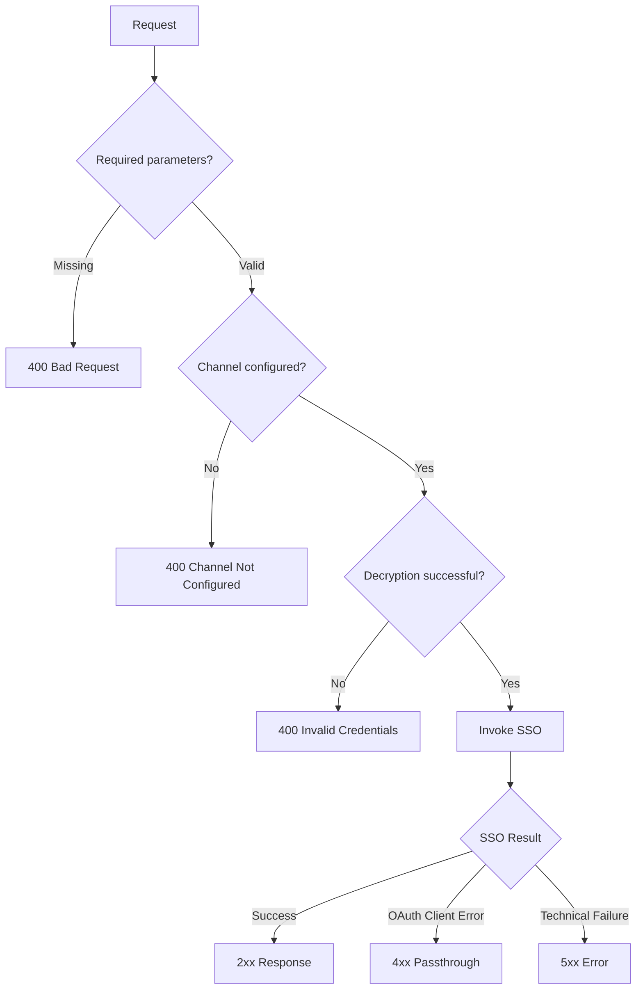

Typical responses:

| HTTP | Scenario |
|---:|---|
| `200` | Token successfully generated |
| `400` | Missing required parameters |
| `400` | Channel not configured |
| `400` | Invalid encrypted payload or credentials |
| `4xx` | OAuth/SSO error when passthrough applies |
| `5xx` | Internal technical error |
| `5xx` | Downstream communication failure according to configured policy |

Downstream errors should preserve the configured passthrough policy without exposing sensitive information.

---

# SSO Integration

The facade forwards decrypted credentials to the OAuth token endpoint associated with the requested realm.

Conceptually:

```text
POST {SSO_URL}/realms/{realm}/protocol/openid-connect/token
```

with:

```http
Content-Type: application/x-www-form-urlencoded
```

and:

```text
client_id=<decrypted>
client_secret=<decrypted>
grant_type=<decrypted>
scope=<decrypted>
```

The integration is implemented using Spring `WebClient`.

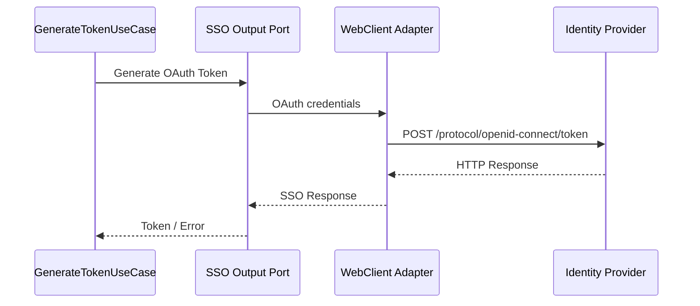

---

# Reactive Flow

The HTTP processing pipeline remains reactive end-to-end using Spring WebFlux and Project Reactor.

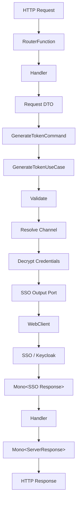

Blocking operations should not be introduced into the HTTP reactive pipeline.

Avoid:

```java
.block();
```

inside the WebFlux processing flow.

---

# Running Locally

## Requirements

Make sure the following tools are available:

- Java 21 or newer;
- Git;
- Gradle Wrapper included in the repository;
- an OAuth 2.0 / OpenID Connect identity provider such as Keycloak.

Verify Java:

```bash
java -version
```

---

## Clone Repository

```bash
git clone <repository-url>
cd ms-securitytoken-facade
```

---

## Configure Environment

Linux/macOS:

```bash
export SSO_URL=http://localhost:8080
export CHANNEL_8_KEY=<development-key>
export CHANNEL_8_IV=<development-iv>
```

Windows PowerShell:

```powershell
$env:SSO_URL="http://localhost:8080"
$env:CHANNEL_8_KEY="<development-key>"
$env:CHANNEL_8_IV="<development-iv>"
```

Use development-only credentials when running the application locally.

---

## Compile

Linux/macOS:

```bash
./gradlew clean build
```

Windows:

```powershell
.\gradlew clean build
```

---

## Run

Linux/macOS:

```bash
./gradlew bootRun
```

Windows:

```powershell
.\gradlew bootRun
```

The default local port can then be accessed according to the application's configured `server.port`.

---

# Testing

Run all automated tests with:

Linux/macOS:

```bash
./gradlew test
```

Windows:

```powershell
.\gradlew test
```

---

## Cryptographic Tests

`AesCbcDecryptor` provides a helper intended exclusively for testing encrypted payload generation.

Example:

```java
String encrypted =
        AesCbcDecryptor.encryptWithSaltForTesting(
                "test-client",
                channelKey,
                iv
        );
```

An encryption/decryption round-trip test can be implemented as:

```java
@Test
void shouldEncryptAndDecryptClientId() {

    String encrypted =
            AesCbcDecryptor.encryptWithSaltForTesting(
                    "test-client",
                    channelKey,
                    iv
            );

    String decrypted =
            decryptor.decrypt(
                    encrypted,
                    channelKey,
                    iv
            );

    assertEquals("test-client", decrypted);
}
```

Tests must use synthetic credentials.

Never use:

- production client secrets;
- production encryption keys;
- production IVs;
- real access tokens;
- production encrypted payloads.

---

# Build

The project uses **Gradle Wrapper**, so installing Gradle globally is not required.

## Linux / macOS

```bash
./gradlew clean
./gradlew test
./gradlew build
./gradlew bootRun
```

## Windows

```powershell
.\gradlew clean
.\gradlew test
.\gradlew build
.\gradlew bootRun
```

To execute a complete verification before committing:

```bash
./gradlew clean build
```

---

# Contributing

Contributions are welcome.

If you want to contribute:

1. Fork the repository.
2. Create a feature branch.
3. Implement your changes.
4. Add or update automated tests.
5. Run the complete build.
6. Commit your changes.
7. Push your branch.
8. Open a Pull Request.

Example:

```bash
git checkout -b feature/improve-token-validation

./gradlew clean build

git add .
git commit -m "feat: improve token validation"

git push origin feature/improve-token-validation
```

Before submitting a Pull Request, verify that:

- all automated tests pass;
- no credentials or secrets were committed;
- no `.block()` calls were introduced into the reactive HTTP pipeline;
- new infrastructure integrations are implemented behind output ports;
- domain/application logic remains independent of infrastructure;
- sensitive fields are masked in logs;
- cryptographic changes include automated tests;
- public API changes are documented in this README.

---

## Commit Convention

Conventional Commit-style messages are recommended:

```text
feat: add channel configuration validation
fix: handle invalid encrypted payload
refactor: isolate SSO webclient adapter
test: add legacy encryption tests
docs: improve architecture documentation
build: update Gradle dependencies
```

---

# License

This project is licensed under the **Apache License 2.0**.

See the [LICENSE](LICENSE) file for details.

---

## Disclaimer

This project provides an implementation of a security facade and cryptographic interoperability mechanism.

Before using it in production environments, review the cryptographic configuration, secret-management strategy, transport security, dependency versions and operational security requirements applicable to your environment.